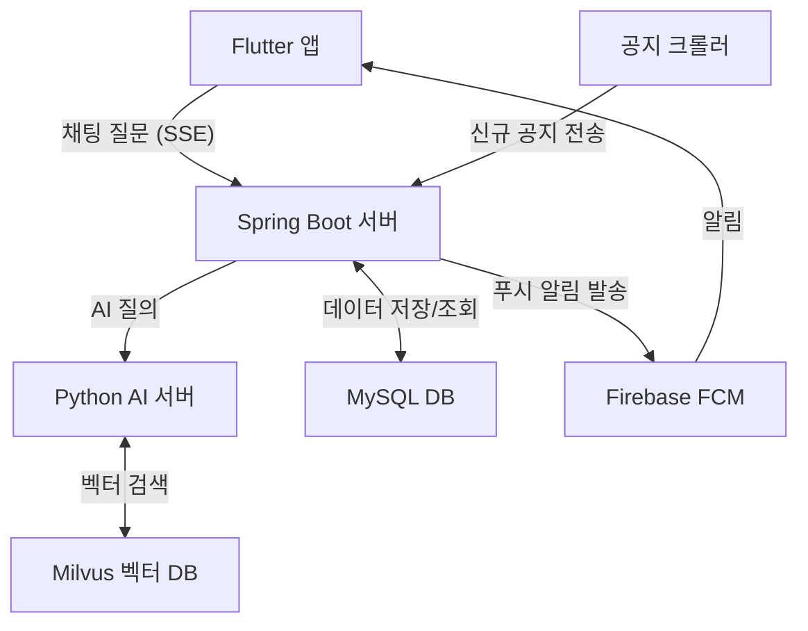
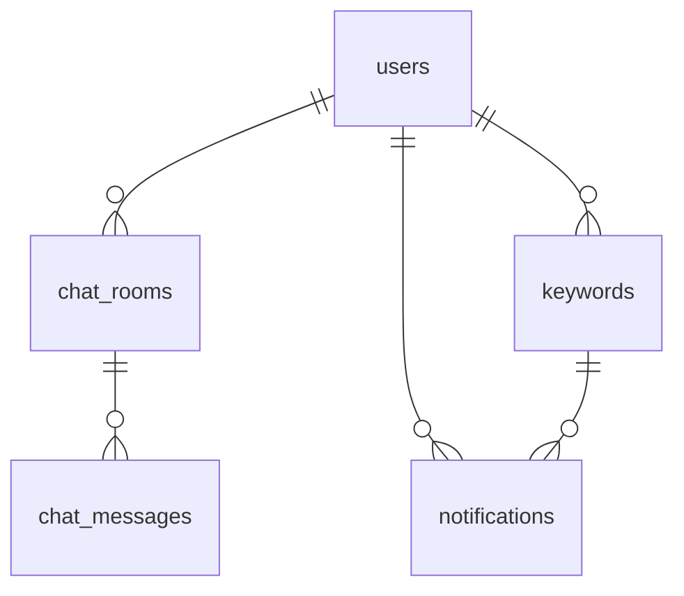

# Hoseo-LENS

호서대학교 공지사항 AI 챗봇 서비스

호서대 공지사항이 여러 게시판에 흩어져 있어 학생들이 원하는 정보를 찾기 어려운 문제를 해결하기 위해 개발했습니다.
공지 내용을 AI가 학습하여 질문하면 바로 답변하고, 관심 키워드의 신규 공지를 푸시 알림으로 받을 수 있습니다.

---

## 기술 스택

| 분류 | 기술 |
|------|------|
| Backend | Java 17, Spring Boot 4.x |
| AI Server | Python, FastAPI |
| Frontend | Flutter (Dart) |
| Database | MySQL, Milvus (벡터 DB) |
| Push | Firebase FCM |
| Cloud | Naver Cloud Platform |

---

## 주요 기능

- **AI 챗봇** : 호서대 공지사항 기반 질문·답변 (SSE 실시간 스트리밍)
- **푸시 알림** : 키워드 등록 시 신규 공지 FCM 푸시 알림 자동 발송
- **채팅 히스토리** : 대화 내역 저장·조회·삭제
- **FAQ** : 카테고리별 자주 묻는 질문 관리

---

## API 엔드포인트

| Method | URL | 설명 |
|--------|-----|------|
| POST | /api/chat/ask | AI 챗봇 질문 (SSE 스트리밍) |
| GET | /api/faq | FAQ 목록 조회 |
| POST | /api/faq | FAQ 등록 (관리자) |
| PUT | /api/faq/{id} | FAQ 수정 (관리자) |
| DELETE | /api/faq/{id} | FAQ 삭제 (관리자) |
| GET | /api/history/{deviceId} | 채팅방 목록 조회 |
| GET | /api/history/{deviceId}/{chatRoomId} | 채팅 메시지 조회 |
| DELETE | /api/history/{chatRoomId} | 채팅방 삭제 |
| POST | /api/notification/keyword | 키워드 등록 |
| GET | /api/notification/keyword/{deviceId} | 키워드 목록 조회 |
| DELETE | /api/notification/keyword/{keywordId} | 키워드 삭제 |
| PUT | /api/notification/setting/{deviceId} | 알림 설정 변경 |
| POST | /api/notices/new | 신규 공지 수신 (크롤러 웹훅) |
| POST | /api/user/fcm-token | FCM 토큰 등록 |
| POST | /api/user/categories | 카테고리 일괄 등록 |

---

## 주요 구현

**SSE 스트리밍**
- AI 서버 응답을 토큰 단위로 분리해 실시간 전달
- heartbeat(3초 간격)로 180초 장시간 연결 안정화

**FCM 푸시 알림**
- 크롤러가 신규 공지 전송 시 키워드 매칭 후 자동 발송
- 중복 알림 방지 및 토큰 만료(UNREGISTERED) 감지 후 DB 자동 삭제

**채팅 히스토리**
- 채팅방 목록 최신순 조회, 메시지 시간순 조회
- 채팅방 삭제 시 메시지 먼저 삭제 후 채팅방 삭제 (cascade 처리)
- deviceId 기반 본인 채팅방만 접근 가능

**FAQ**
- 카테고리별 활성 FAQ 조회
- 삭제 시 DB에서 제거하지 않고 비활성화 처리 (soft delete)
- 관리자 키 인증을 통한 등록·수정·삭제

**인증**
- 관리자 API : X-Admin-Key 헤더 인증
- 크롤러 웹훅 : X-API-Key 헤더 인증

---

## 시스템 아키텍처

---

## DB 구조

---

## 담당 역할

- Spring Boot 백엔드 설계 및 5개 도메인 REST API 구현 (채팅, FAQ, 히스토리, 키워드, 알림)
- SSE 스트리밍 + heartbeat로 AI 서버 응답 실시간 전달
- Firebase FCM 키워드 매칭 알림 파이프라인 구현 (중복 방지, 토큰 만료 자동 처리)
- API 키 기반 인증 및 접근 제어 구현
- NCP 서버 SSH/SCP 배포 자동화 스크립트 작성
